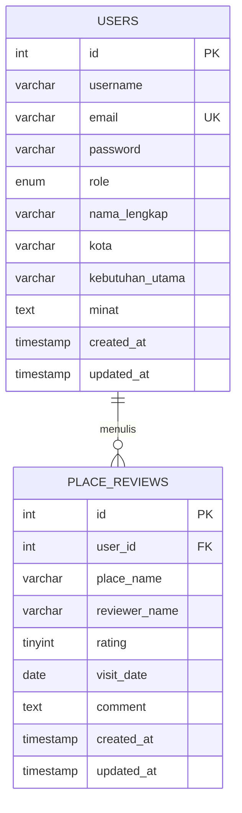
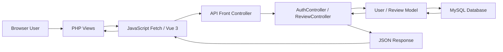

# Bukti Indikator Teknis Tugas Besar

Dokumen ini hanya catatan teknis project, bukan laporan akhir.

## Desain UI Sistem

- Halaman UI utama ada di `home.php`, `peta.php`, `profil.php`, `kuliner.php`, `kafe.php`, `warisan.php`, `event.php`, `eduction.php`, `login.php`, dan `register.php`.
- Layout aplikasi dipusatkan di `assets/js/webandoo-layout.js` dan `assets/css/webandoo-layout.css`.
- Komponen Vue dashboard ada di `home.php` dan `assets/js/vue-system-panel.js`.

## Database ERD

Entitas utama:

- `users`
  - `id` sebagai primary key
  - `role` untuk hak akses `user` dan `admin`
  - data profil: `username`, `email`, `nama_lengkap`, `kota`, `kebutuhan_utama`, `minat`
- `place_reviews`
  - `id` sebagai primary key
  - `user_id` sebagai foreign key ke `users.id`
  - data review: `place_name`, `reviewer_name`, `rating`, `visit_date`, `comment`

Relasi:

```text
users (1) ---- (N) place_reviews
```

Mermaid ERD:



File schema: `database/schema.sql`.

## Diagram atau Rancangan Sistem

Alur request:

```text
Browser
  -> PHP Page View
  -> JavaScript async fetch / Vue component
  -> api/auth.php atau api/reviews.php
  -> Controller
  -> Model
  -> MySQL
  -> JSON response
```

Mermaid flowchart:



## Indikator Penilaian Program

1. Struktur kode rapi, modular, efisien, dan mudah dipelihara
   - `app/Core`, `app/Controllers`, `app/Models`, `api`, `assets`, `partials`, dan `database` sudah dipisahkan.

2. Memisahkan layout seperti header, footer, sidebar, dan komponen lainnya
   - Header/footer reusable ada di `assets/js/webandoo-layout.js`.
   - Style layout reusable ada di `assets/css/webandoo-layout.css`.
   - Navigasi utama berperan sebagai komponen layout bersama untuk semua halaman aplikasi.
   - Guard halaman dipisah di `partials/auth_guard.php`, `partials/guest_guard.php`, dan `partials/admin_guard.php`.

3. Menerapkan model asynchronous
   - `assets/js/auth.js` memakai `fetch` untuk login, register, profil, dan logout.
   - `assets/js/review.js` memakai `fetch` untuk CRUD review.
   - `assets/js/vue-system-panel.js` memakai async fetch untuk dashboard ringkasan.

4. Menerapkan arsitektur MVC atau HMVC
   - Controller: `app/Controllers/AuthController.php`, `app/Controllers/ReviewController.php`
   - Model: `app/Models/User.php`, `app/Models/Review.php`
   - View: halaman PHP seperti `home.php`, `peta.php`, `profil.php`
   - Core helper: `app/Core/Request.php`, `app/Core/Response.php`, `app/Core/Auth.php`

5. Menerapkan RESTful API
   - `GET api/reviews.php`
   - `GET api/reviews.php?id=1`
   - `POST api/reviews.php`
   - `PUT api/reviews.php?id=1`
   - `DELETE api/reviews.php?id=1`
   - Endpoint lama berbasis `?action=` tetap dipertahankan agar halaman lama tidak rusak.

6. Menerapkan multi autentikasi dan role pengguna
   - Kolom `role` di tabel `users` mendukung `user` dan `admin`.
   - `partials/admin_guard.php` disediakan untuk halaman admin.
   - `peta.php` hanya mengaktifkan mode admin jika `window.webandooIsAdmin` bernilai true dari session API.
   - Admin dapat menambah konten global/halaman melalui `api/content.php`.
   - Admin dapat menambah dan menghapus lokasi peta melalui `api/locations.php`.

7. Menggunakan framework front-end
   - Vue 3 digunakan pada dashboard ringkasan sistem di `home.php`.
   - Script komponen: `assets/js/vue-system-panel.js`.

8. Mengintegrasikan materi di luar pembelajaran kelas
   - Leaflet map dan Leaflet Routing Machine untuk peta interaktif dan rute.
   - Vue 3 untuk komponen dashboard.
   - Password hashing PHP untuk keamanan login.
   - REST method API dan JSON response.
   - Remember Me memakai cookie token dan hash token di database.

## Akun Demo Admin

```text
Email: admin@webandoo.test
Password: admin123
Role: admin
```

## Validasi Teknis Terakhir

- Semua file PHP di folder `Tubes` lolos `php -l`.
- File `assets/js/webandoo-layout.js` lolos `node --check`.
- File `assets/js/vue-system-panel.js` lolos `node --check`.
- Login admin berhasil dan API `me` mengembalikan `role: admin`.
- REST review berhasil diuji dengan `POST`, `PUT`, dan `DELETE`.
